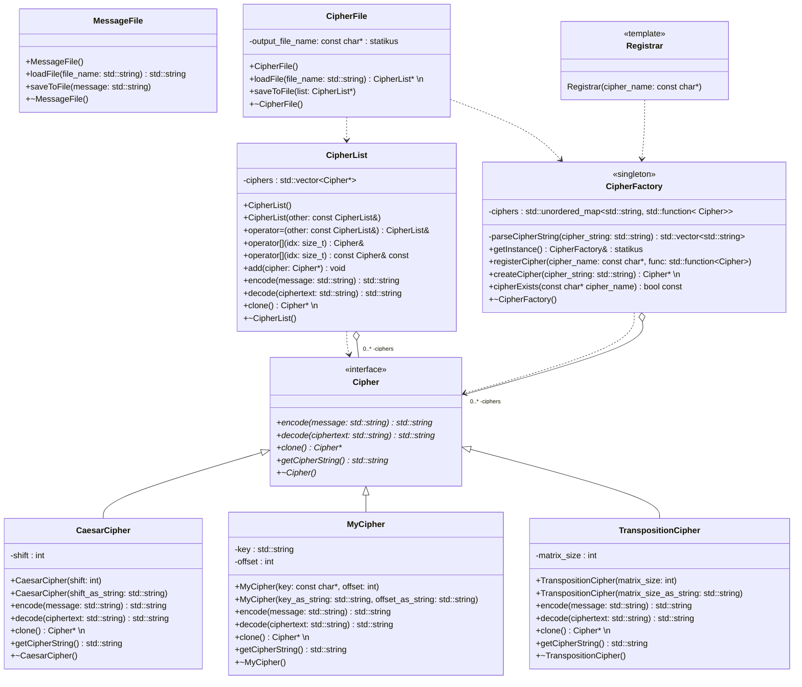
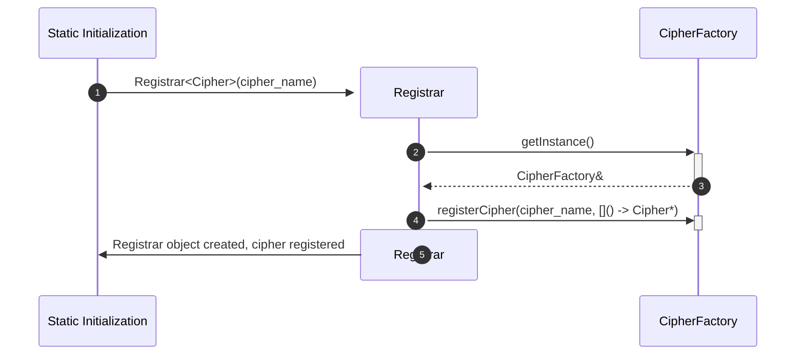
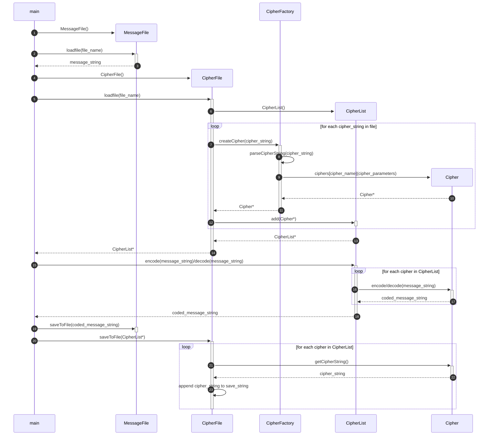

## Terv - UML diagramok

### Osztálydiagram

A CipherFile::saveToFile() függvény a dinamikusan változó kódolások helyes működése végett van implementálva.

### Sekvenciadiagramok

A main függvény lefutása előtt a következő műveletek történnek:

A main függvény végrehajtása során a következő műveletek történnek:

